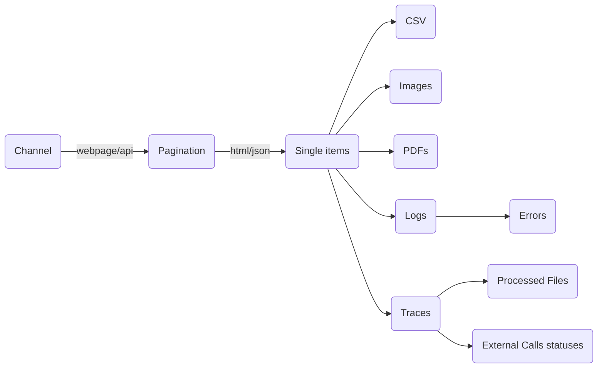

<div align="center">

  
  <h1>UltScan</h1>
  
  <p>
    Magic Data Acquisition
  </p>

<h4>
    <a href="#">View Demo</a>
  <span> · </span>
    <a href="#">Documentation</a>
  <span> · </span>
    <a href="#">Report Bug</a>
  <span> · </span>
    <a href="#">Request Feature</a>
  </h4>
</div>

<br />

<!-- Table of Contents -->

# :notebook_with_decorative_cover: Table of Contents

- [:notebook_with_decorative_cover: Table of Contents](#notebook_with_decorative_cover-table-of-contents)
  - [:star2: About the Project](#star2-about-the-project)
    - [:camera: Screenshots](#camera-screenshots)
    - [:space_invader: Tech Stack](#space_invader-tech-stack)
    - [:dart: Features](#dart-features)
  - [:toolbox: Getting Started](#toolbox-getting-started)
    - [:bangbang: Prerequisites](#bangbang-prerequisites)
    - [:gear: Installation](#gear-installation)
    - [:triangular_flag_on_post: Deployment](#triangular_flag_on_post-debug)
    - [:triangular_flag_on_post: Debug](#triangular_flag_on_post-deployment)
  - [:eyes: Overview](#eyes-overview)
  - [:eyes: Usage](#eyes-usage)
  - [:compass: Roadmap](#compass-roadmap)
  - [:grey_question: FAQ](#grey_question-faq)

<!-- About the Project -->

## :star2: About the Project

<!-- Screenshots -->

### :camera: Screenshots

<div align="center"> 
  
</div>

<!-- TechStack -->

### :space_invader: Tech Stack

<details>
  <summary>Server</summary>
  <ul>
    <li>Python</li>
    <li><a href="https://github.com/jotyGill/openpyn-nordvpn">OpenPyn</a></li>
    <li><a href="https://github.com/seatgeek/fuzzywuzzy">FuzzyWuzzy</a></li>
  </ul>
</details>

<!-- Features -->

### :dart: Features

- Add new channels/sources (from api/raw html)
- Anti duplication system
- Auto image download

<!-- Getting Started -->

## :toolbox: Getting Started

<!-- Prerequisites -->

### :bangbang: Prerequisites

This project uses Yarn as package manager

```bash
git clone https://github.com/idaraty-org/ultscan
```

<!-- Installation -->

### :gear: Installation

Install my-project with npm

```bash
pip install -r requirements.txt
```

<!-- Deployment -->

### :triangular_flag_on_post: Deployment

#### :warning: Todo

<!-- Debug -->

### :triangular_flag_on_post: Debug

```bash
python exec_ultscan.py  --dir-config="./demo-configs" --password="62f2b54421635099efe491ae13f56b37"
```


<!-- Overview -->

## :eyes: Overview



<!-- Usage -->

## :eyes: Usage

usages:
🛑 not used for now
💪 data enrichment
📊 analytics
⚓️ postprocessing
🛠️ configuration

<table>
  <tr>
    <th>
    Property
    </th>
    <th>
    Usage
    </th>
    <th>
    Values
    </th>
    <th>
    Description
    </th>
  </tr>
    <tr>
        <td>
            batch_id
        </td>
        <td>
            🛠️📊
        </td>
        <td>
            my-batch-id
        </td>
        <td>
            Channel ID (each channel can have multiple batches). Example: mychannel1-arabic; mychannel1-french;
            mychannel1-science ; mychannel1-culture
        </td>
    </tr>
    <tr>
        <td>
            orgs
        </td>
        <td>
            💪📊
        </td>
        <td>
            slug-of-org
        </td>
        <td>
            Force the tags of specific organizations for this batch/channel
        </td>
    </tr>
    <tr>
        <td>
            themes
        </td>
        <td>
            💪📊
        </td>
        <td>
            slug-of-theme
        </td>
        <td>
            Force the tags of specific themes for this batch/channel
        </td>
    </tr>
    <tr>
        <td>
            lang
        </td>
        <td>
            💪📊
        </td>
        <td>
            None
        </td>
        <td>
            Force specific lang for this batch
        </td>
    </tr>
    <tr>
        <td>
            rubrique_website
        </td>
        <td>
            💪📊
        </td>
        <td>
            culture
        </td>
        <td>
            The default channel section
        </td>
    </tr>
    <tr>
        <td>
            default_pagination_limit
        </td>
        <td>
            🛑
        </td>
        <td>
            None
        </td>
        <td>
            Force specific pagination limit in monitoring mode for this batch (high number of pages for highly active sources)
        </td>
    </tr>
    <tr>
        <td>
            loop_mode
        </td>
        <td>
            🛑
        </td>
        <td>
            number_increase
        </td>
        <td>
            Force specific lang for this batch
        </td>
    </tr>
    <tr>
        <td>
            loop_start
        </td>
        <td>
            🛠️
        </td>
        <td>
            1 (INT)
        </td>
        <td>
            Pagination loop range start
        </td>
    </tr>
    <tr>
        <td>
            loop_end
        </td>
        <td>
            🛠️
        </td>
        <td>
            10 (INT)
        </td>
        <td>
            Pagination loop range end
        </td>
    </tr>
    <tr>
        <td>
            loop_step
        </td>
        <td>
            🛠️
        </td>
        <td>
            1 (INT)
        </td>
        <td>
            Pagination loop range (+step)
        </td>
    </tr>
    <tr>
        <td>
            page_actu_home
        </td>
        <td>
            🛑
        </td>
        <td>
            url
        </td>
        <td>
            Default Homepage
        </td>
    </tr>
    <tr>
        <td>
            page_actu_loop
        </td>
        <td>
            🛑
        </td>
        <td>
            url with 'ACTU_NBR'
        </td>
        <td>
            URL used for the loop with ```ACTU_NBR``` variable
        </td>
    </tr>
    <tr>
        <td>
            reg_ul
        </td>
        <td>
            🛠️
        </td>
        <td>
            ul#container
        </td>
        <td>
            CSS selector of the list container (in pagination)
        </td>
    </tr>
    <tr>
        <td>
            reg_li
        </td>
        <td>
            🛠️
        </td>
        <td>
            li.item
        </td>
        <td>
            CSS selector of list items (in pagination)
        </td>
    </tr>
    <tr>
        <td>
            reg_li_a
        </td>
        <td>
            🛠️
        </td>
        <td>
            a.link
        </td>
        <td>
            CSS selector of the link to the post (in pagination)
        </td>
    </tr>
    <tr>
        <td>
            reg_li_title
        </td>
        <td>
            🛠️
        </td>
        <td>
            a span::text
        </td>
        <td>
            CSS selector of the post title (in pagination)
        </td>
    </tr>
    <tr>
        <td>
            reg_li_date
        </td>
        <td>
            🛠️
        </td>
        <td>
            span.date
        </td>
        <td>
            CSS selector of the published date (in pagination)
        </td>
    </tr>
    <tr>
        <td>
            reg_li_image
        </td>
        <td>
            🛠️
        </td>
        <td>
            img.preview::attr(src)
        </td>
        <td>
            CSS selector of the image preview (in pagination)
        </td>
    </tr>
</table>

Sample channel config (HTML)

```python
{
   "batch_id": "jamaity-culture",
   "orgs": "",
   "rubrique_website": "culture",
   "default_pagination_limit": "general",
   "themes": "culture",
   "lang": "FR",
   "loop_mode": "number_increase",
   "loop_start": 1,
   "loop_step": 1,
   "loop_end": 9,
   "page_actu_home": "https://jamaity.org/forsa/?type=all&region=tunisie&theme=arts-culture",
   "page_actu_loop": "https://jamaity.org/forsa/page/ACTU_NBR/?type=all&region=tunisie&theme=arts-culture",
   "reg_ul": ".container .masonry-container",
   "reg_li": ".col-md-4.item",
   "reg_li_a": "a",
   "reg_li_title": "a::text",
   "reg_li_date": False,
   "reg_li_image": False,
   "single_title": False,
   "single_content": "#details .text-preview",
   "single_image": "img.event-img-big::attr(src)",
   "single_date": "meta[name='date']::attr(content)",
   "single_date_format": "timestamp",
   "single_tags": False,
   "deadline": ".row.clearfix > div.col-md-3.col-sm-3.col-xs-12.no-margin > p",
   "deadline_format": "%d%m%Y",
    "apply_url": False,
   "document_url": False,
   "document_title": False
}
```

Sample channel config (HTML pagination from API)

```python
test_model = {
  "batch_id": "khaleejesque",
  "orgs": "",
  "rubrique_website": "culture",
  "default_pagination_limit": "general",
  "themes": "culture",
  "lang": "EN",
  "loop_mode": "number_increase",
  "loop_start": 1,
  "loop_step": 1,
  "loop_end": 16,
  "extraction_mode": "api", # html (default) / "api"
  "api_header_accept": "application/json, text/javascript, */*; q=0.01",
  "api_header_accept_language": 'fr-FR,fr;q=0.9',
  "api_header_content_type": 'application/x-www-form-urlencoded; charset=UTF-8',
  "api_header_origin": 'https://khaleejesque.me',
  "api_header_referer": 'https://khaleejesque.me/radar/',
  "api_header_request_with": 'XMLHttpRequest',
  "api_data_encode": True,
  "api_method": "POST",
  "api_endpoint": "https://khaleejesque.me/wp-admin/admin-ajax.php",
  "api_data": {
      'action': 'dtdr_generate_load_search_data_ouput',
      'current_page': 'ACTU_NBR',
      'type': 'type2',
      'gallery': 'featured_image',
      'post_per_page': '20',
      'columns': '3',
      'apply_isotope': 'true',
      'isotope_filter': '',
      'apply_child_of': 'false',
      'featured_items': 'false',
      'excerpt_length': '20',
      'features_image_or_icon': '',
      'features_include': '',
      'no_of_cat_to_display': '4',
      'apply_equal_height': 'false',
      'custom_options': '{"ad_items":"","ad_location":"listing","pricerange_start":"","pricerange_end":""}',
      'keyword': '',
      'user_latitude': '',
      'user_longitude': '',
      'use_radius': '',
      'radius': '',
      'radius_unit': '',
      'list_items': '',
      'categories': '',
      'tags': '',
      'cities': '',
      'neighborhood': '',
      'countystate': '',
      'countries': '',
      'ctype': '',
      'startdate': '',
      'pricerange_start': '',
      'pricerange_end': '',
      'features_query': '',
      'features_total_query': '',
      'sellers': '',
      'incharges': '',
      'orderby': '',
      'mls_number': '',
      'others': '',
      'load_data': 'true',
      'load_map': 'false',
      'listing_id': '49421',
      'listing_title': 'POPUP by COMFEST',
      'listing_permalink': 'https://khaleejesque.me/listings/popup-by-comfest/',
      'first_class': '',
      'loader': 'true',
      'loader_parent': '.dtdr-listing-output-data-container',
  },
  "api_nbr_key": "current_page",
  "api_result_type": "json",
  "api_result_key": "data",
  "api_loop_mode": "html", # html / json

  "page_actu_home": "https://khaleejesque.me/radar/",

  "page_actu_loop": False,
  "reg_ul": ".dtdr-listings-container .dtdr-listings-item-container",
  "reg_li": ".dtdr-column:not(.grid-sizer)",
  "reg_li_a": ".dtdr-listings-item-title a",
  "reg_li_title": ".dtdr-listings-item-title a::text",
  "reg_li_date": False,
  "reg_li_image": ".dtdr-listings-feature-image-holder img::attr(src)",
  "single_title": False,
  "single_content": ".elementor-widget-text-editor",
  "single_image": False,
  "single_date": "meta[property='og:article:published_time']::attr(content)",
  "single_date_format": "%Y-%m-%d%H:%M:%S",
  "single_tags": "ul.dtdr-listings-taxonomy-list li",
  "deadline": False,
  "deadline_format": False,
  "apply_url": "a.elementor-animation-grow",
  "document_url": False,
  "document_title": False
}
```

<!-- Output -->
### Output
| slug  | title_en | title_fr | title_ar | excerpt_en | excerpt_fr | excerpt_ar | tags  | sources | source_url | apply_url | image_url | image_name | langs | published_at | extracted_at | deadline | rubrique_website | themes | organizations | content_en | content_fr | content_ar | content_html |
|-------|----------|----------|----------|------------|------------|------------|-------|---------|------------|-----------|-----------|------------|-------|--------------|--------------|----------|------------------|--------|---------------|------------|------------|------------|--------------|
| **A** | **B**    | **C**    | **D**    | **E**      | **F**      | **G**      | **H** | **I**   | **J**      | **K**     | **L**     | **M**      | **N** | **O**        | **P**        | **Q**    | **R**            | **S**  | **T**         | **U**      | **V**      | **W**      | **X**        |
|       |          |          |          |            |            |            |       |         |            |           |           |            |       |              |              |          |                  |        |               |            |            |            |              |
|       |          |          |          |            |            |            |       |         |            |           |           |            |       |              |              |          |                  |        |               |            |            |            |              |


<!-- Roadmap -->

## :compass: Roadmap

- [x] Data acquisitions - Add tags
- [x] Stop processing if current page has already processed items (monitoring mode only)
- [x] Generate requirements.txt
- [ ] Add verbose mode (to be processed into GUI)
- [ ] Migrate from fuzzywuzzy to TheFuzz
- [ ] Apply custom `default_pagination_limit` for specific channel models
- [ ] MultiThread processing
- [ ] Add auto appendable fields to batch config (sector...)
- [x] Compile to Executable
- [x] Authorized and secure run (password as param -pw="PASSWORD")
- [ ] Add custom fields to collect in models [other_fields] = [{field_slug, field_type(str, date)}]
- [ ] Add google analytics usage tracking ```PyAnalyticsClass```

<!-- FAQ -->

## :grey_question: FAQ

- Compile Python to executable - Plan A (Python To C)

  - Transform to C lang
  - Compile using
    ```bash
    gcc my_script.c -o my_script
    ```
  - Crashes with message (python.h not found)
  - Plan A standby for now

- Compile Python to executable - Plan B (Nuitka)
  - Try nuitka https://nuitka.net/pages/overview.html
  - Guide: https://github.com/Nuitka/Nuitka
  - Tested in ```/dev/test-nuitka``` without ```virtualenv```
  - Generate ```program.exe``` (windows) / ```program.bin``` (other machines)
    ```bash
    python -m nuitka --follow-imports script.py --company-name=ultscan --product-name=testScript --file-version=1 --product-version=1
    ```
  - Run ```program.exe/bin``` to exec
    ```bash
    ./script.bin
    ```
  - Hello world (size = 256ko)
  - Prod exec_ulscan (size = 77.8 Mo) - 7 minutes to generate
  - Prod exec_ulscan in virtualenv (size = 222.2 Mo) - 23 minutes to generate
  - Working Prod exec_ulscan in virtualenv with dist + onefile (dist size = 409 Mo + .app size = 80 Mo) - 26 minutes to generate
  - retry and fix issue ```ModuleNotFoundError: No module named 'pandas._config.localization'```
    - https://github.com/Nuitka/Nuitka/issues/1765
    - https://github.com/Nuitka/Nuitka/issues/557
    - https://www.infoworld.com/article/3673932/intro-to-nuitka-a-better-way-to-compile-and-distribute-python-applications.html
  - Try with different params (poc with pandas /dev/test-nuitka-pandas) - 
    - MacOs (SUCCESS ✅):
      ```bash
      python -m nuitka --follow-imports --plugin-enable=numpy --show-modules --standalone --macos-app-icon=assets/logo.icns --macos-create-app-bundle --company-name=ultscan --product-name=ultscan --file-version=0.1 --product-version=0.1 --onefile exec_ultscan.py
      ```
      ```bash
      ./exec_ultscan.dist/exec_ultscan --dir-config="./demo-configs" --pw="62f2b54421635099efe491ae13f56b37"
      ```
    - Win (untested):
      ```bash
      python -m nuitka --follow-imports --plugin-enable=numpy --show-modules --standalone --windows-icon-from-ico=assets/logo.ico --mingw64 --company-name=ultscan --product-name=ultscan --file-version=0.1 --product-version=0.1 --onefile exec_ultscan.py
      ```

- Compile Python to executable - Plan C (Distribute to executable)
  - Try ```pip install pyinstaller```

